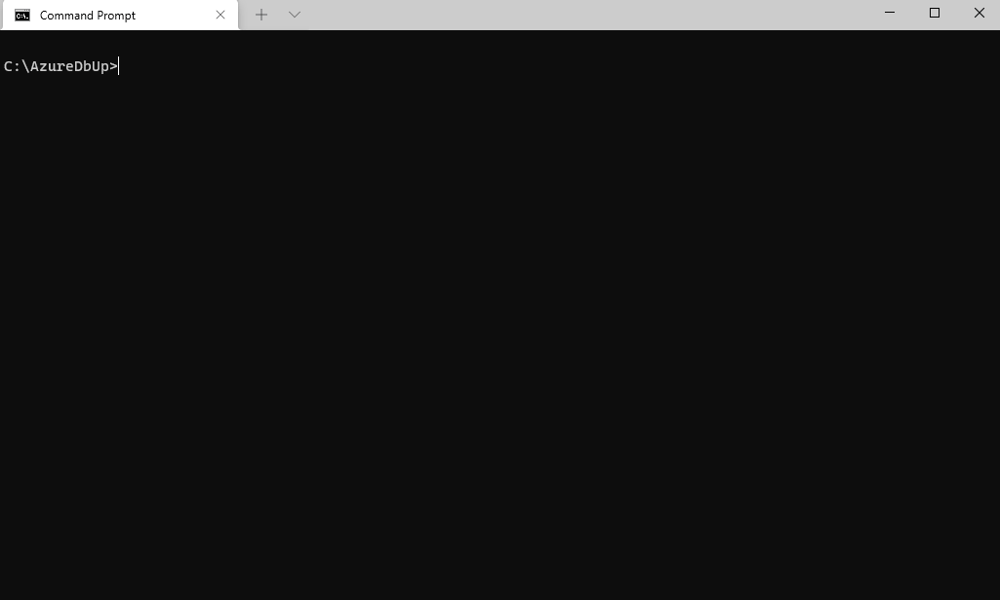
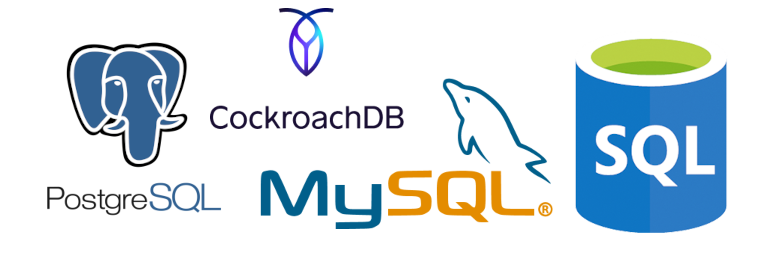

# AzureDbUp

Update your database from anywhere! AzureDbUp is a dotnet console application that updates your target sql database from the command line using DbUp.  DbUp tracks which SQL scripts have been run already, and runs the change scripts that are needed to get your database up to date.  This console application pairs nicely with devops tools like Azure Devops and Github Actions so you can automate your database upgrades. 

## Getting Started
 - Prereq: Download and install [dotnet core](https://dotnet.microsoft.com/download).
 - Download the [latest release](https://github.com/TroyWitthoeft/AzureDbUp/releases/download/release-latest/release-latest.zip) of AzureDbUp. Unzip the files to a folder.
 - Edit and save your .sql scripts in the sql folder. 
 - Launch a terminal and call `dotnet AzureDbUp.dll`
 - Enter a connection string, choose your options, and let it rip!

 
## DevOps

To fully automate your database upgrades and track changes in source control, clone this repository and have developers commit scripts into the sql folder. Create an action or workflow that builds this application and executes the console application from with you CI/CD pipeline in a non-interactive mode. 

`dotnet AzureDbUp.dll --conn-string "Server=tcp:my-example-server.database.windows.net,1433;Initial Catalog=my-example-database" --db-engine "sqlserver" --auth-mode "azure"`

Database changes will be safely recorded in both your git commit history and your execution logs. 
## Databases supported

Azure DbUp currently supports: Azure Sql, MySql, PostgreSQL, CockoachDB 

More support for other databases is planned. 
## Contributing

Have a feedback?  Have a feature idea? Found a bug?  Pull requests are welcome and encouraged! 

## Project Dependencies

 - This application was developed in VS Code and targets the .NET 5.0 framework.
 - This application uses the [DbUp](https://dbup.readthedocs.io/) library to manage database updates. 
 - This application uses [Spectre Console](https://github.com/spectreconsole/spectre.console) to beautify the console output.
 - This application uses System CommandLine [DragonFruit](https://github.com/dotnet/command-line-api/wiki) library to simplify command line argument parsing.
 - This application uses the [Azure Identity](https://github.com/Azure/azure-sdk-for-net/blob/main/sdk/identity/Azure.Identity/README.md) library for authentication and azure sql token retrieval.
 - ~~This application uses [Microsoft Graph](https://docs.microsoft.com/en-us/graph/overview) library to walk and list the current users Azure AD security groups.~~

## License
[MIT](https://choosealicense.com/licenses/mit/)
