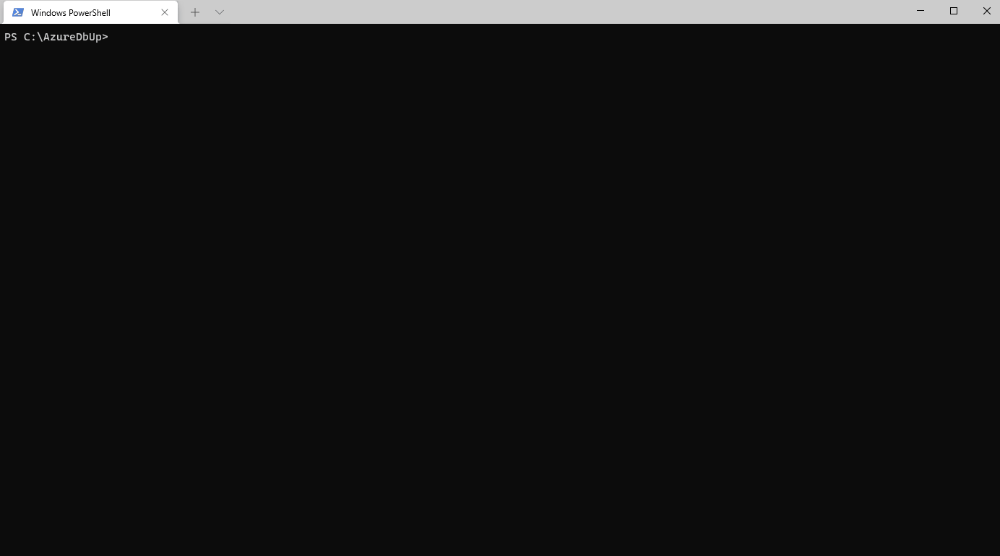

# AzureDbUp

AzureDbUp is a run-anywhere cross-platform console application that updates a target Azure SQL databases with sql scripts using DbUp.  
Download this repository using VS Code.  Download this project, build it, set your connection string in the `launch.json` save your change/migration scripts into a folder and call Devlopers save sql scripts Save your sql scripts into folders, and call this application from the commandline with a connection string to update your target database. 

> `dotnet AzureDbUp.dll --connection-string "Server=tcp:my-example-server.database.windows.net,1433;Initial Catalog=my-example-database"`

If you are cloning this repository and would like to test it against your own database, please open this project in VSCode and set your connection string inside the `launch.json` file.
 

## Project Dependencies

 - This application was developed in VS Code and targets the .NET 5.0 framework.
 - This application uses the [DbUp](https://dbup.readthedocs.io/) library to manage database updates. 
 - This application uses [Spectre Console](https://github.com/spectreconsole/spectre.console) to beautify the console output.
 - This application uses System CommandLine [DragonFruit](https://github.com/dotnet/command-line-api/wiki) library to simplify command line argument parsing.
 - This application uses the [Azure Identity](https://github.com/Azure/azure-sdk-for-net/blob/main/sdk/identity/Azure.Identity/README.md) library for authentication and azure sql token retrieval.
 - ~~This application uses [Microsoft Graph](https://docs.microsoft.com/en-us/graph/overview) library to walk and list the current users Azure AD security groups.~~

## Contributing
This is a small one-person project, and yes pull requests are welcome! 
For major changes, please open an issue first to discuss what you would like to change.

## License
[MIT](https://choosealicense.com/licenses/mit/)